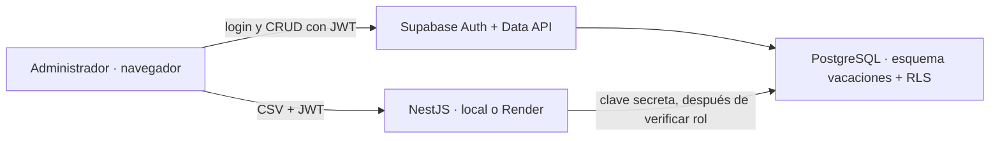

# ICSI Vacaciones

Panel administrativo inspirado en la claridad operativa de absentify para visualizar vacaciones, coincidencias de personal y saldos por empleado. El sistema ya incluye un frontend React responsive, autenticación con Supabase, base PostgreSQL en español y una API NestJS mínima para importaciones privilegiadas.

## Arquitectura



- `frontend/`: React 19 + Vinext, panel, calendario, filtros, formularios, modo claro/oscuro y datos demostrativos cuando no hay variables de Supabase.
- `api/`: NestJS. Solo atiende `/salud`, documentación Swagger e importación CSV administrativa.
- `database/001_esquema_inicial.sql`: esquema completo, datos base, vistas, RPC, índices y políticas RLS.
- `database/diagrama_vacaciones.dbml`: modelo para pegar en dbdiagram.io.

## Arranque local

Requiere Node.js 22 o posterior.

Frontend:

```powershell
cd frontend
Copy-Item .env.example .env.local
npm ci
npm run dev
```

Abre `http://localhost:3000`.

API NestJS, en otra terminal:

```powershell
cd api
Copy-Item .env.example .env
npm ci
npm run start:dev
```

La API queda en `http://localhost:3001`, su estado en `http://localhost:3001/salud` y Swagger en `http://localhost:3001/documentacion`.

La configuración completa de Supabase, creación del administrador y despliegue está en [docs/CONFIGURACION_SUPABASE.md](docs/CONFIGURACION_SUPABASE.md).

## Validación

```powershell
cd frontend
npm run lint
npm test

cd ..\api
npm run lint
npm run build
npm test -- --runInBand
npm run test:e2e -- --runInBand
```

